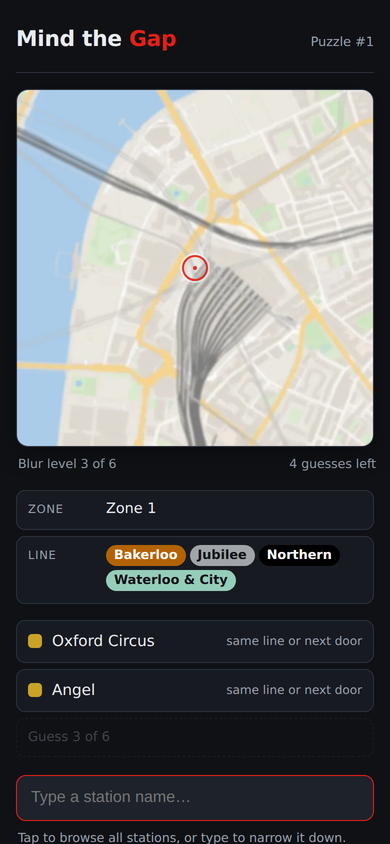
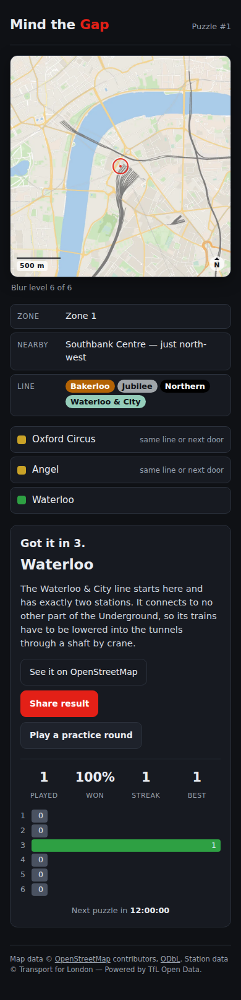
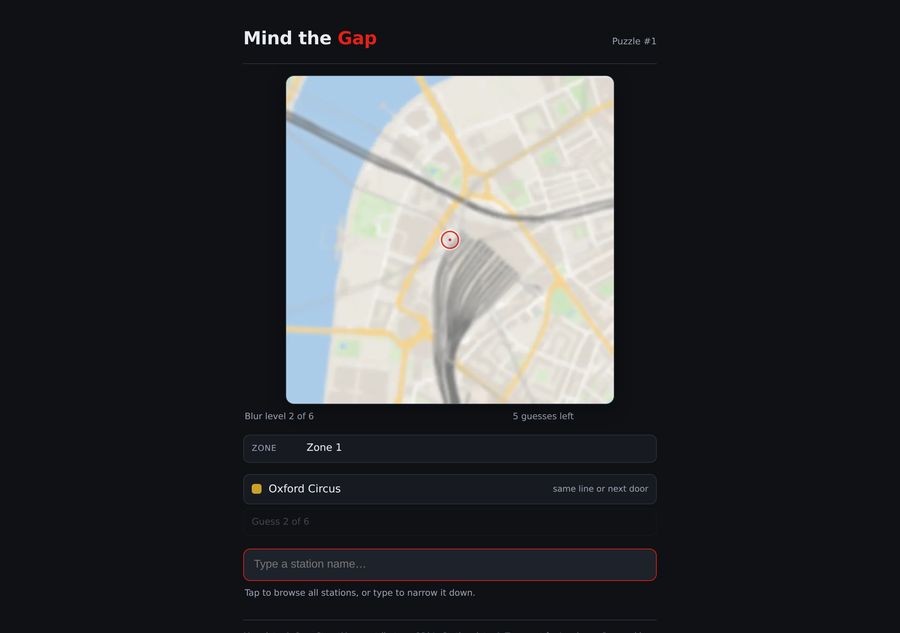

# Mind the Gap

A daily puzzle game: guess the London Underground station from a heavily blurred map crop centred on it. Every wrong guess sharpens the image and unlocks a hint. Six guesses. One puzzle a day, the same for everyone.

Think Wordle meets Worldle, for London.

**▶ Play it: [zakixahmed.github.io/mind-the-gap](https://zakixahmed.github.io/mind-the-gap/)**

<p>
  
  
</p>



## How to play

1. You are shown a blurred map centred on a mystery Tube station.
2. Type a station name and pick it from the autocomplete list (no free text, so no spelling disputes).
3. A wrong guess sharpens the map one level and reveals the next hint, in this order: **zone → line(s) → borough → first letter → number of letters**.
4. You have six guesses. Guess it and share your emoji grid:
   🟩 correct · 🟨 same line or an adjacent station · ⬛ wrong.
5. A new puzzle unlocks at midnight (London time) — the same one for everyone.
6. Want more? Practice rounds are unlimited and draw from all 272 stations.
   They don't count towards your streak.

## Running locally

The game is pure static files, so any local web server works:

```bash
cd public
python3 -m http.server 8000
# open http://localhost:8000
```

A server is required, not optional: the game fetches `data/stations.json`, and
browsers block that over `file://`. Nothing to install for the game itself. The Python environment below is only needed to regenerate data or map images.

## Regenerating the map data

```bash
python3 -m venv .venv
source .venv/bin/activate        # Windows: .venv\Scripts\activate
pip install -r requirements.txt

python scripts/build_stations.py   # → data/stations.json       (~5 min, see below)

# Map data. Download the extracts first — see below for which ones.
python scripts/fetch_osm_local.py data/pbf/*.osm.pbf   # → data/raw/     (~10 min)
python scripts/render_maps.py --offline                # → public/maps/<slug>/1-6.webp

python scripts/build_landmarks.py  # → data/landmarks.json     (instant, offline)
python scripts/build_schedule.py   # → data/schedule.json      (instant, offline)
```

**`fetch_osm_local.py`** builds the OpenStreetMap cache from local extracts.
Download these from [Geofabrik](https://download.geofabrik.de/europe/united-kingdom/england/)
into `data/pbf/`: `greater-london` covers most of the network, and the
Metropolitan and Central line outliers need `buckinghamshire` (Amersham,
Chesham), `hertfordshire` (Watford, Rickmansworth, Moor Park) and `essex`
(Epping, Theydon Bois, Loughton). The script extracts the union of every
feature the map draws, then slices it per station into `data/raw/`.

It replaced a run against the Overpass API, which the wider 2.5 km crop made
untenable: eight stations in 48 minutes, or roughly 27 hours for the full set,
with most of that spent waiting on requests that returned 504. Public Overpass
rate-limits per IP, and 272 heavy queries is not a reasonable thing to ask of
donated infrastructure. A local extract has no rate limit, needs no network
during the run, and is reproducible — the same `.pbf` always yields the same
maps. `render_maps.py` still has its Overpass path for filling a single gap.

**`render_maps.py`** draws a label-free map around each station from that cache
and writes six blur levels as WebP. Because the data is local, re-tuning the
cartography is free: `--offline` re-renders from cache, `--only slug,slug` does
a few stations, `--contact-sheet` writes a 6-up review image.

**`build_schedule.py`** writes the 100-day order the daily puzzle follows,
mixing famous and obscure stations with never three obscure in a row. Which
stations count as "famous" is an editable list at the top of the script rather
than a hidden constant; `--check` validates the existing schedule without
rewriting it. The launch date lives in `schedule.json` so the game and the
schedule cannot disagree about which day is puzzle #1.

**`build_stations.py`** pulls the 11 Underground lines, their stations and route
sequences from the TfL Unified API (34 requests), then reverse-geocodes each
station with OpenStreetMap's Nominatim to get its borough. Nominatim allows one
request per second, so a full run takes about five minutes; every response is
cached in `data/raw/` (git-ignored) so re-runs are instant and the raw evidence
for any record can be inspected. Flags: `--offline` rebuilds from the cache
only, `--no-borough` skips Nominatim for quick iteration. The script validates
the result (station count, zones, lines, boroughs, adjacency, coordinates) and
refuses to write `stations.json` if anything is missing. An optional
`TFL_APP_KEY` environment variable raises TfL's anonymous rate limit.

## Tech decisions

Short version — the reasoning lives in [docs/DECISIONS.md](docs/DECISIONS.md) and the structure in [docs/ARCHITECTURE.md](docs/ARCHITECTURE.md).

| Area | Choice | Why (one line) |
|------|--------|----------------|
| Front end | Single `public/index.html`, no framework, no build step | Small enough to read in one sitting; deploys anywhere |
| Data pipeline | Python 3 scripts in `scripts/` | Run once, commit the output; the game never calls an API |
| Station data | TfL Unified API + Nominatim for boroughs | Authoritative zones, lines and route order; OSM has none of those. See ADR-005 |
| Map imagery | Drawn from raw OSM data via Overpass, not tiles | Tile licences forbid bulk pre-rendering, and tiles show station names. See ADR-008 |
| Blur method | Gaussian `[36, 20, 10, 5, 2, 0]`, stored as WebP | Non-linear so guess 3 is the turning point; WebP keeps the set at 16 MB. See ADR-009, ADR-010 |
| Daily seeding | London calendar-date arithmetic → index into `data/schedule.json` | No server, identical for everyone, correct across DST. See ADR-014 |
| Hosting | GitHub Pages from `public/` | Free, static, relative paths only |

## Deployment

The site is `public/` and nothing else — no build step, no bundler, no server.
[`.github/workflows/deploy.yml`](.github/workflows/deploy.yml) publishes that
folder to GitHub Pages on every push to `main`.

GitHub Pages can only serve a branch's root or its `/docs` folder, so rather
than rename `public/` to suit the host, the workflow uploads it as the Pages
artifact and the repository keeps the layout the project was designed around.
Before publishing, the workflow checks that the data files exist and that every
one of the 100 scheduled stations has all six map levels rendered — the two
ways this site could break silently.

Every asset path in `index.html` is relative, so the game works served from a
subfolder (`/mind-the-gap/`) or from a domain root, with no base-path config.

To deploy a fork: **Settings → Pages → Build and deployment → Source: GitHub
Actions**, then push to `main`.

## Licence and attribution

- **Code:** [MIT](LICENSE).
- **Station data:** [TfL Unified API](https://api.tfl.gov.uk) under the [TfL open data licence](https://tfl.gov.uk/info-for/open-data-users/) — *Powered by TfL Open Data. Contains OS data © Crown copyright and database rights 2016 and Geomni UK Map data © and database rights 2019.* Boroughs from [OpenStreetMap](https://www.openstreetmap.org/copyright) via Nominatim — *© OpenStreetMap contributors, ODbL 1.0.*
- **Map imagery:** drawn from [OpenStreetMap](https://www.openstreetmap.org/copyright) data retrieved via the [Overpass API](https://overpass-api.de) — *© OpenStreetMap contributors*, ODbL. No third-party tiles are used or redistributed. This attribution also appears in the app footer.

## Roadmap

- [x] Phase 1 — scaffold and docs skeleton
- [x] Phase 2 — station dataset (`data/stations.json`)
- [x] Phase 3 — map rendering, six blur levels per station
- [x] Phase 4 — game UI with one hardcoded puzzle
- [x] Phase 5 — daily logic, share grid, stats, countdown, 100-day schedule, practice mode
- [ ] Phase 6 — polish and playtest: how-to-play modal, light mode, footer attribution
- [x] Phase 7 — deployment, real screenshots, `v0.1.0`

**Later, not in MVP:** archive mode for past puzzles, hard mode, distance-and-direction feedback on wrong guesses.

**Known limitation:** the schedule is 100 days and then repeats. Extending it is a matter of raising `LENGTH` in `build_schedule.py` and re-running.

**Deliberately out of scope:** accounts, leaderboards, multiplayer, user-generated puzzles, monetisation, any server.
