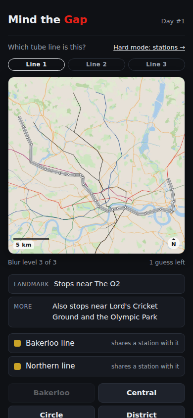
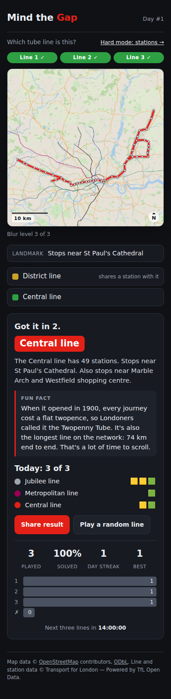
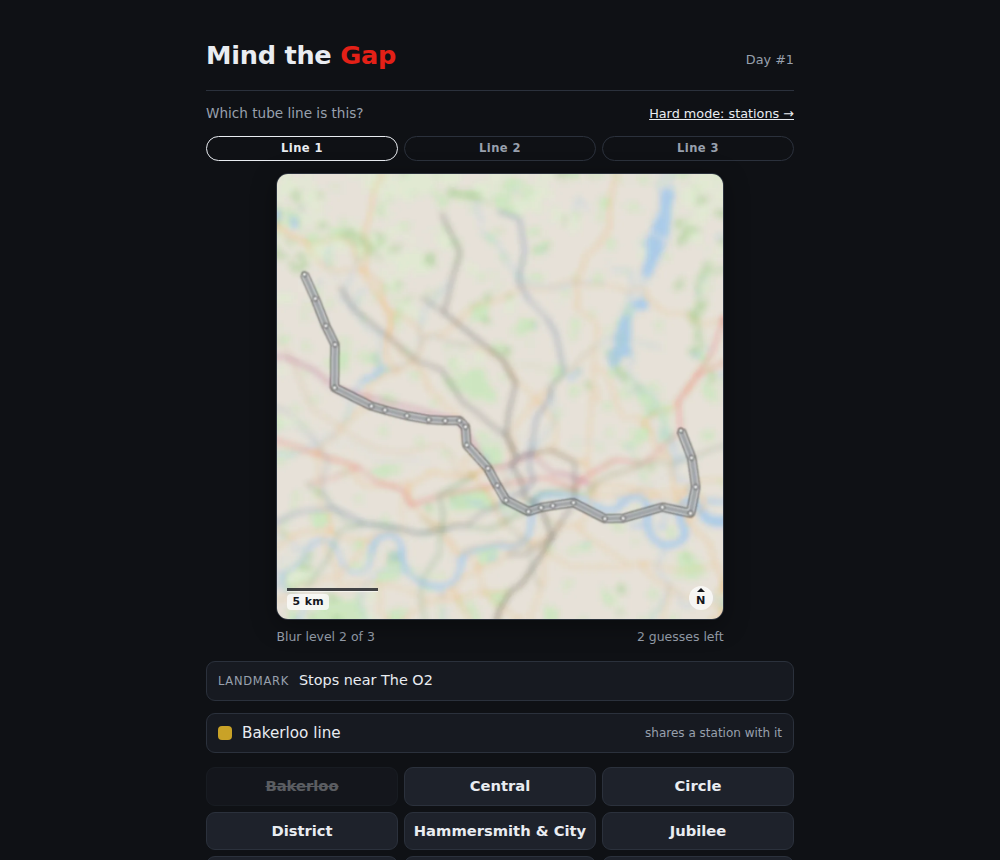

# Mind the Gap — v3

> **Archived README — v0.3.0.** This is the README as it stood for v3, kept so the project's history can be read version by version. Links point at the current repository; the code as it was is at the [`v0.3.0` tag](https://github.com/zakixahmed/mind-the-gap/tree/v0.3.0). What players said about this version is in [FEEDBACK.md](FEEDBACK.md).


**Which tube line is this?** A daily puzzle game about the London Underground:
you're shown a whole tube line drawn over a blurred map of London, and you have
three guesses to name it. Three lines a day, the same for everyone, with
landmark hints and a fun fact after every answer. No London knowledge needed —
and a hard mode for people who have it.

**▶ Play it: [zakixahmed.github.io/mind-the-gap](https://zakixahmed.github.io/mind-the-gap/)**

<p>
  
  
</p>



## How it evolved

Every version went to real players, and what they said decided the next one.
Each version keeps its own folder with the README it shipped with, its
screenshots, and the feedback it got.

| Version | Released | What changed | What players said |
|---|---|---|---|
| [v1](../v1/) — `v0.1.0` | 22 Sep 2026 | First release: 1 km blurred maps; zone, line, borough and letter hints | "Too hard to guess" — and asked for a landmark with the map |
| [v2](../v2/) — `v0.2.0` | 27 Sep 2026 | 2.5 km maps, a softer blur, a scale bar, a "Nearby" landmark hint, tap-to-reveal hints | Still hard to work out the station if you don't know London |
| [v3](./) — `v0.3.0` | 29 Sep 2026 | Guess the **line**, not the station: 11 answers, whole routes in real colours, 3 guesses, 3 puzzles a day, landmark hints, fun facts. Stations become hard mode | Waiting for round 3 |

The full story, version by version, is in [`docs/versions/`](../).

## How to play

1. You're shown one tube line's whole route, in its real colour, over a
   blurred map of London. The other ten lines are drawn faintly for context.
2. Pick which of the 11 lines it is. The answer buttons are deliberately
   uncoloured — knowing which colour belongs to which name is part of the game.
3. You have three guesses. A wrong one sharpens the map and unlocks a hint,
   face down — tap it when you want it. The hints name famous landmarks the
   line stops near.
4. After each answer you get a fun fact about the line. Three lines make a
   day; share one emoji grid for all three:
   🟩 correct · 🟨 your guess shares a station with the answer · ⬛ no stations in common.
5. New lines at midnight (London time), the same for everyone. Every line comes
   up once in every eleven puzzles, and no day repeats a line.
6. Want more? "Play a random line" gives unlimited practice rounds.

### Hard mode: stations

The original game lives on at [`stations.html`](../../../public/stations.html), one tap
from the front page: guess the *station* from a blurred 2.5 km map centred on
it, with six guesses and a hint ladder of **zone → a nearby landmark → line(s)
→ borough → first letter and length**. One puzzle a day from a 100-day
schedule, plus practice rounds over all 272 stations. It keeps its own stats.

## Running locally

The game is pure static files, so any local web server works:

```bash
cd public
python3 -m http.server 8000
# open http://localhost:8000
```

A server is required, not optional: the game fetches its data files, and
browsers block that over `file://`. Nothing to install for the game itself. The Python environment below is only needed to regenerate data or map images.

## Regenerating the map data

```bash
python3 -m venv .venv
source .venv/bin/activate        # Windows: .venv\Scripts\activate
pip install -r requirements.txt

python scripts/build_stations.py   # → data/stations.json       (~5 min, see below)

# Map data. Download the extracts first — see below for which ones.
python scripts/fetch_osm_local.py data/pbf/*.osm.pbf   # → data/raw/     (~10 min)
python scripts/render_maps.py --offline                # → public/maps/<slug>/1-6.webp

python scripts/build_landmarks.py --extract data/pbf/*.osm.pbf   # landmark candidates (~1 min)
python scripts/build_landmarks.py  # → data/landmarks.json     (instant, offline)
python scripts/build_schedule.py   # → data/schedule.json      (instant, offline)

# The line game (v3). Needs the OSM cache and landmark candidates above.
python scripts/render_lines.py --sheet   # → public/lines/<line>/1-3.webp  (seconds)
python scripts/build_line_hints.py       # → public/data/line_hints.json   (instant)
```

**`render_lines.py`** draws one picture per line: the whole route in its real
TfL colour, over a base map thinned from the same OSM extract (water, large
green spaces, main roads), with the other ten lines faint underneath. The route
geometry is TfL's own, already saved by `build_stations.py`, so nothing is
downloaded. The map and the route blur separately — the map hides where in
London you are, the route stays readable — and each line is framed to fit, from
44 km across for the District to 6 km for the Waterloo & City.

**`build_line_hints.py`** writes three landmarks per line. They are picked by
hand for the places a visitor has heard of, and the script proves each one:
it must exist in the OSM data, sit within 1 km of a station on its line,
contain no line's name, and not be used for any other line.
`public/data/line_facts.json` holds one fun fact per line, each with the source
it was checked against.

**`fetch_osm_local.py`** builds the OpenStreetMap cache from local extracts.
Download these from [Geofabrik](https://download.geofabrik.de/europe/united-kingdom/england/)
into `data/pbf/`: `greater-london` covers most of the network, and the
Metropolitan and Central line outliers need `buckinghamshire` (Amersham,
Chesham), `hertfordshire` (Watford, Rickmansworth, Moor Park) and `essex`
(Epping, Theydon Bois, Loughton). The script extracts the union of every
feature the map draws, then slices it per station into `data/raw/`.

Use `curl -L`: the `-latest` URLs are a 302 to a dated file, and without `-L`
you get a few hundred bytes of redirect HTML named `.osm.pbf`. Downloading the
dated filename the redirect points at (`greater-london-260924.osm.pbf` rather
than `-latest`) is what makes a rebuild genuinely reproducible — `-latest`
means something different every week.

It replaced a run against the Overpass API, which the wider 2.5 km crop made
untenable: eight stations in 48 minutes, or roughly 27 hours for the full set,
with most of that spent waiting on requests that returned 504. Public Overpass
rate-limits per IP, and 272 heavy queries is not a reasonable thing to ask of
donated infrastructure. A local extract has no rate limit, needs no network
during the run, and is reproducible — the same `.pbf` always yields the same
maps. `render_maps.py` still has its Overpass path for filling a single gap.

**`render_maps.py`** draws a label-free map around each station from that cache
and writes six blur levels as WebP. Because the data is local, re-tuning the
cartography is free: `--offline` re-renders from cache, `--only slug,slug` does
a few stations, `--contact-sheet` writes a 6-up review image.

**`build_schedule.py`** writes the 100-day order the daily puzzle follows,
mixing famous and obscure stations with never three obscure in a row. Which
stations count as "famous" is an editable list at the top of the script rather
than a hidden constant; `--check` validates the existing schedule without
rewriting it. The launch date lives in `schedule.json` so the game and the
schedule cannot disagree about which day is puzzle #1.

**`build_stations.py`** pulls the 11 Underground lines, their stations and route
sequences from the TfL Unified API (34 requests), then reverse-geocodes each
station with OpenStreetMap's Nominatim to get its borough. Nominatim allows one
request per second, so a full run takes about five minutes; every response is
cached in `data/raw/` (git-ignored) so re-runs are instant and the raw evidence
for any record can be inspected. Flags: `--offline` rebuilds from the cache
only, `--no-borough` skips Nominatim for quick iteration. The script validates
the result (station count, zones, lines, boroughs, adjacency, coordinates) and
refuses to write `stations.json` if anything is missing. An optional
`TFL_APP_KEY` environment variable raises TfL's anonymous rate limit.

## Tech decisions

Short version — the reasoning lives in [docs/DECISIONS.md](../../../docs/DECISIONS.md) and the structure in [docs/ARCHITECTURE.md](../../../docs/ARCHITECTURE.md).

| Area | Choice | Why (one line) |
|------|--------|----------------|
| Front end | Two single-file pages, `index.html` (lines) and `stations.html` (hard mode), no framework, no build step | Each small enough to read in one sitting; deploys anywhere |
| v3 question | Which *line*, not which station | 11 answers a newcomer can learn, rather than 272 only a Londoner can place. See ADR-025 |
| Daily lines | Three a day, dealt from seeded shuffled decks of all eleven | Same for everyone with no server; every line once per eleven puzzles; no repeats in a day |
| Data pipeline | Python 3 scripts in `scripts/` | Run once, commit the output; the game never calls an API |
| Station data | TfL Unified API + Nominatim for boroughs | Authoritative zones, lines and route order; OSM has none of those. See ADR-005 |
| Map imagery | Drawn from raw OSM data (Geofabrik extracts), not tiles | Tile licences forbid bulk pre-rendering, and tiles show station names. See ADR-008, ADR-022 |
| Blur method | Gaussian `[36, 20, 10, 5, 2, 0]`, stored as WebP | Non-linear so guess 3 is the turning point; WebP keeps the set at 16 MB. See ADR-009, ADR-010 |
| Daily seeding | London calendar-date arithmetic → index into `data/schedule.json` | No server, identical for everyone, correct across DST. See ADR-014 |
| Hosting | GitHub Pages from `public/` | Free, static, relative paths only |

## Deployment

The site is `public/` and nothing else — no build step, no bundler, no server.
[`.github/workflows/deploy.yml`](../../../.github/workflows/deploy.yml) publishes that
folder to GitHub Pages on every push to `main`.

GitHub Pages can only serve a branch's root or its `/docs` folder, so rather
than rename `public/` to suit the host, the workflow uploads it as the Pages
artifact and the repository keeps the layout the project was designed around.
Before publishing, the workflow checks that the data files exist, that every
one of the 100 scheduled stations has all six map levels rendered, and that all
eleven lines have their three map levels and their hints — the ways this site
could break silently.

Every asset path in both pages is relative, so the game works served from a
subfolder (`/mind-the-gap/`) or from a domain root, with no base-path config.

To deploy a fork: **Settings → Pages → Build and deployment → Source: GitHub
Actions**, then push to `main`.

## Licence and attribution

- **Code:** [MIT](../../../LICENSE).
- **Station and line data:** [TfL Unified API](https://api.tfl.gov.uk) under the [TfL open data licence](https://tfl.gov.uk/info-for/open-data-users/) — *Powered by TfL Open Data. Contains OS data © Crown copyright and database rights 2016 and Geomni UK Map data © and database rights 2019.* Boroughs from [OpenStreetMap](https://www.openstreetmap.org/copyright) via Nominatim — *© OpenStreetMap contributors, ODbL 1.0.*
- **Map imagery:** drawn from [OpenStreetMap](https://www.openstreetmap.org/copyright) data, read from [Geofabrik](https://download.geofabrik.de) regional extracts (v0.1.0 used the [Overpass API](https://overpass-api.de)) — *© OpenStreetMap contributors*, ODbL. The landmark hints in both modes come from the same data. Line routes are TfL's. No third-party tiles are used or redistributed. This attribution also appears in the app footer.
- **Fun facts:** written for this project; each is checked against the source recorded next to it in `public/data/line_facts.json` (Wikipedia, the London Transport Museum).

## Roadmap

- [x] Phase 1 — scaffold and docs skeleton
- [x] Phase 2 — station dataset (`data/stations.json`)
- [x] Phase 3 — map rendering, six blur levels per station
- [x] Phase 4 — game UI with one hardcoded puzzle
- [x] Phase 5 — daily logic, share grid, stats, countdown, 100-day schedule, practice mode
- [ ] Phase 6 — polish and playtest: how-to-play modal, light mode, footer attribution
- [x] Phase 7 — deployment, real screenshots, `v0.1.0`
- [x] `v0.2.0` — the legibility pass after round-1 feedback: 2.5 km maps, a softer blur curve, landmark hints, tap-to-reveal hints (see [`docs/versions/v2`](../v2/))
- [x] `v0.3.0` — the line game for players who don't know London, with stations as hard mode (see [`docs/versions/v3`](./))

**Later:** how-to-play screen and light mode (phase 6); if round 3 finds the line game too easy, hold the route's colour back until a later guess or show a stretch of the line instead of the whole route; distance-and-direction feedback in hard mode.

**Known limitations:** with eleven lines, each one comes round every few days, and anyone who knows the tube map's colours will find the first guess easy — both accepted for now (ADR-025). The station schedule is 100 days and then repeats. Extending it is a matter of raising `LENGTH` in `build_schedule.py` and re-running.

**Deliberately out of scope:** accounts, leaderboards, multiplayer, user-generated puzzles, monetisation, any server.
